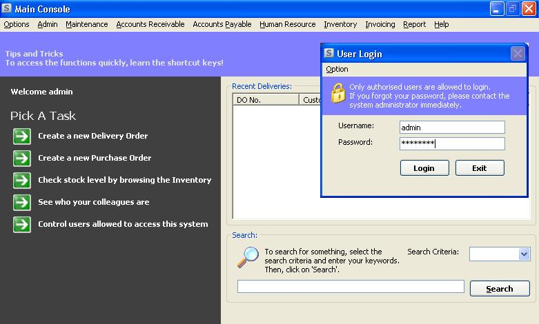



## Simple Client Server Inventory Control System

### Description

Files needed to distribute along:

CMDLG32.OCX

MSCOMCTL.OCX - 1MB (VB 6 SP3) or

COMCTL32.OCX - 596KB (VB 5 SP3)

MSWORD.OLB

Client-server app to keep track of inventory. Main functionalities include accounts payable, accounts receivable, human

resource, user management and reporting. User management includes access control to the main functionalities. Main page even

include a ticker system allowing messages to be conveyed to the users systematically. Simple reports are mostly available

only on-screen (non crystal report). Please vote for me or at least provide your feedback as I need to know what areas

require improvement or change. I also need to know how well am I doing in order to decide upon to further develop the key

areas.

In the future, will try to use object-oriented programming style because it is a good way of programming. Will be

standardising the way of reporting as well.

Haven't tested in a real multi client environment. If anyone of you have tested it, please let me know if there are any

issues of concurrency and stuff like that. Any other suggestions?

Please leave your comment here! Thanks!
 
### More Info
 

             |
---                |---
**Submitted On**   |2004-07-13 02:47:08
**By**             |[Roy Yong](https://github.com/Planet-Source-Code/PSCIndex/blob/master/ByAuthor/roy-yong.md)
**Level**          |Intermediate
**User Rating**    |4.9 (259 globes from 53 users)
**Compatibility**  |VB 6\.0
**Category**       |[Miscellaneous](https://github.com/Planet-Source-Code/PSCIndex/blob/master/ByCategory/miscellaneous__1-1.md)
**World**          |[Visual Basic](https://github.com/Planet-Source-Code/PSCIndex/blob/master/ByWorld/visual-basic.md)
**Archive File**   |[Simple\_Cli1769817142004\.zip](https://github.com/Planet-Source-Code/roy-yong-simple-client-server-inventory-control-system__1-54947/archive/master.zip)

